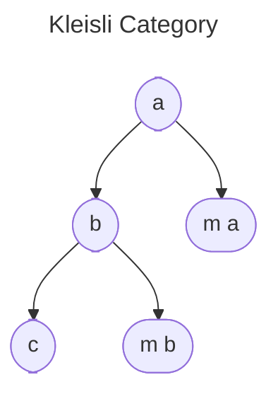
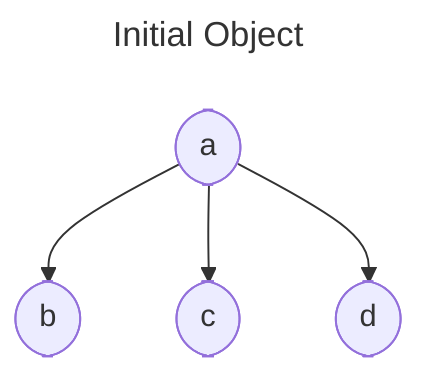
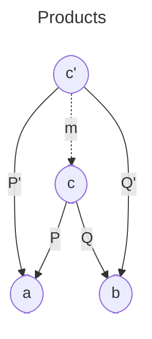
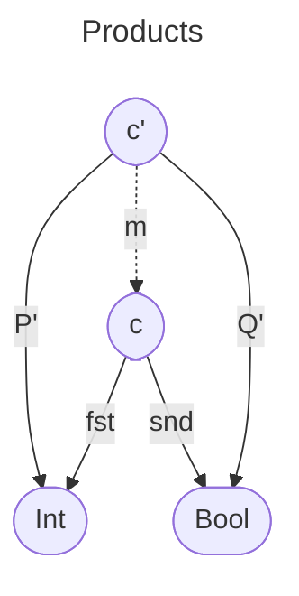
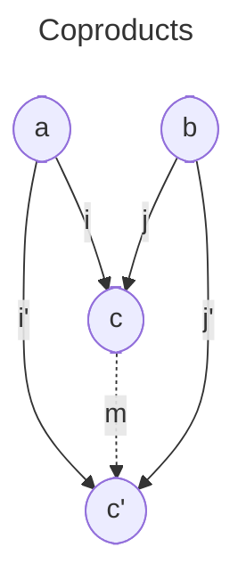
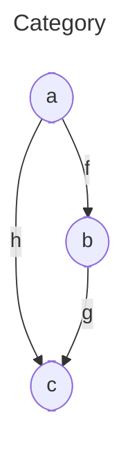
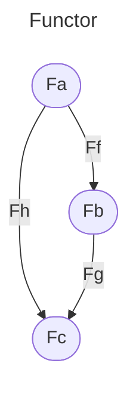
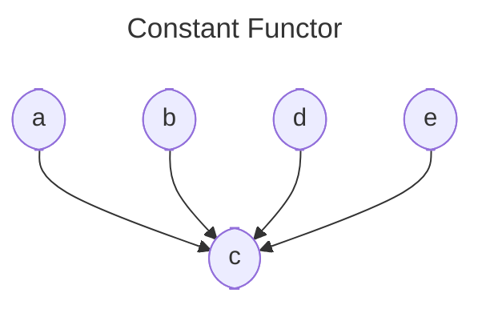
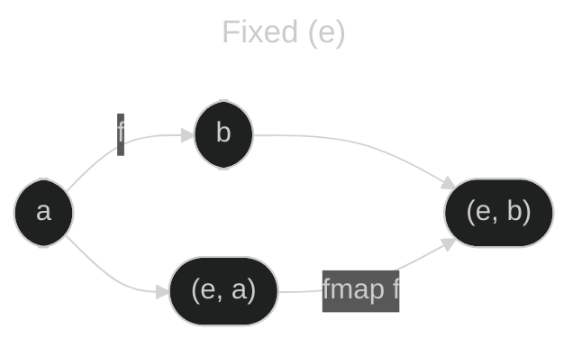
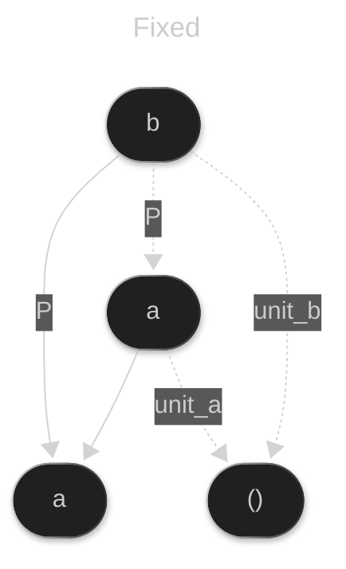

# category-theory

## Category

A category has Objects and arrows (morphisms) that go from one object to another.

### Properties of a category

- Abstraction: Forget the implementation details and threat them as equal.

- Composition: `(h o g) o f = h o (g o f)`

a ------> b -----> c -----> d a ------------------------> d
f g h h o g o f

- Identity: An object has a morphism that maps to itself

Arrows(Morphism): is a path from an object `a` to another `b`. Where objects are names for end of arrows.

a ------> b
f

## Functions

Mathematical function that for an element of the domain only corresponds a single element of the codomain, but for a codomain element there are multiple correponding elements in the domain.

Domain ------ Codomain

### Isomorphism

A morphism that can be inverted, eg:

a ------> b ------> a `f :: a -> b` `g :: b -> a` `f o g = `<code>id<sub>a</sub></code> `g o f = `<code>id<sub>b</sub></code>
f g

Injective (Monomorphism): The elements from Codomain has at max a single image (`f`) element from the Domain. No shrinking colapsing.


Surjective (Epimorphism): Every element from the Codomain has at least one image from the Domain.


Bijective (Isomorphism): Injective and Surjective at the same time, it means 1:1 relationship.


## Void

Unit type `() :: ()`

`unit :: a -> ()`

## Categories

Number of elements (nodes):

- 0 -> empty Category
- 1 -> Single Element with id function

### Pre-Orders

Arrows are not "functions"

Composition

```Haskell
>= :: a >= b
a >= b >= c -> a >= c
```

Identity

```Haskell
a >= a
a <= a
```

### Hom-set

Is a set of arrows

C(a, b), C(b, c)

### Partial Orders

Similar to orders but no loops, e.g. no (`a -> b , b -> a`)

## Monoid

A monoid should satisfy the following properties:

- Asociativity: (a _ b) _ c = a _ (b _ c)
- Composition: Multiple arrows can be composed
- Identity: Has the id arrow
- Unit: For all `e` such as a binary operator `*` we have `e * a = a`

String is a monoid:

```Haskell
("a" ++ "b") ++ "c" = "a" ++ ("b" ++ "c")
"a" ++ "" = "a"
```

### From the Category Theory perspective

A monoid is a single object category, with a homset `M(m, m)` and the binary operator in this case is the composition of arrows from the homset, this is the monoidal product, e.g. if you have two elements from the homset `f` and  `g` their product will be `f . g`.

## Kleisli category


## Cartesian product of sets

A(1, 2) & B(a, b) => AxB = A^2 = {(1, a), (1, b), (2, a), (2, b)}

## Terminal Objects

All categories end in the terminal object `()`

```Haskell
a -> ()
b -> ()
```

```
For every object `a` there is a function `f` to the terminal object `()`

forall a => f :: a -> () & g :: a -> (), then >> f = g, this means that f is unique
```

## Initial Object

Is the initial object that has a unique arrow to any other object. (Void)



## Universal construction

- Pattern: single object
- Ranking: a is better than b if there is a unique arrow from b to a b -> a

## Products

A product is a pair of objects that have projections that maps to the both elements of the product.

```haskell
  -- for an object c
  p :: c -> a
  q :: c -> b

  -- and there is a pretender c'
  p' :: c' -> a
  q' :: c' -> b

  -- with a unique morphism m
  m :: c' -> c
  p' :: p o m
  q' :: q o m
```



This implies that:

```javascript
P o m = P'
Q o m = Q'
```

In haskell



```Haskell
  Pair :: (a, b)
  fst (x, _) = x
  snd (_, y) = y
```

Bad problems:

```Haskell
  -- Pojection ==> (Int, Bool)

  -- P' can be anything but should return Int, this is bad because we lose information
  P' :: (Int, Int, Bool) -> Int
  P' (x, _, _) = x

  -- Q' also lose information
  Q' :: (Int, Int, Bool) -> Bool
  Q' (_, _, b) = b

  -- m should transform c' to c
  m :: (Int, Int, Bool) -> (Int, Bool)
  m (x, _, b) = (x, b)
```

## Coproducts

Instead of projections we have injections, thus sum of two types that can be one or another but not both:



Thus:

```Haskell
  i' = m o i
  j' = m o j

  -- Either (sum type)
  data Either a b = Left a | Right b

  -- x :: Either Int Bool
  f :: Either Int Bool -> Bool
  f Left i = i > o
  f Right b = b
```

## Algebraic data types

```Haskell
-- It's the same information with a different arrangement
-- A function can take (a, b) but not (b, a) but we can create a morphism to transform it

-- Isomorphism
swap :: (a, b) -> (b, a)
swap p = (snd p, fst p)

-- ((a, b), c) ~ (a, (b, c))
asoc ((a, b), c) = (a, (b, c))

-- It's isomorphic with a
-- (a, ()) ~ a

-- From algebra (a * b) * c = a * (b * c)

-- Either a Void ~ a
-- a + 0 = a

-- From algebra a * 0 = 0
-- You can't construct (a, Void) ~ Void

-- a * (b + c) = a * b + a * c (Multiplication and Addition)
-- (a, Either b c) ~ Either (a, b) (a, c)
```

Equation to solve:

```Haskell
-- l(a) = 1 + a * l(a)
-- l(a) - a * l(a) = 1
-- l(a)(1 - a) = 1
-- l(a) = 1/(1 - a)
-- l(a) = Sum (n=0) to Inf :: a^n = 1 + a + a*a + a*a*a ...
data List a = Nil | Const a (List a)

-- l(a) = 1 + a * (1 + a * l(a))
-- l(a) = 1 + a + a * a (1 + a * l(a))
```

## Functors

It's a mapping between two categories.

It's something that preserves structure.

Whenever objects are conected in the source cathegory, they are always conected in the Functor category, we cannot destroy connections.





```Haskell
  h = g . f
  -- And the image under F, preservation of structure is the property of:
  F (g . f) = Fh = Fg . Ff

  -- Also the identity functions
  F ida = idF a
```

Faithful functor is injective on hom-sets
Ful functor is surjective on hom-sets

### Constant functor

Collapses every object in a category to a single constan c



### Endofuctor

It maps inside the same category.

In programming objects are types and morphism are functions.

The type constructor is a mpaping of types

### The Maybe functor

```Haskell
  -- Object mapping
  data Maybe a = Nothing | Just a

  -- Morphism mapping
  fmap :: (a -> b) -> (Maybe a -> Maybe b)
  fmap f Nothing = Nothing
  fmap f (Just x) = Just (f x)

  -- Fuctor preserves composition and identity
  -- The Haskell compiler cannot check Functor conditions

  -- Identity
  -- fmap id = id
  -- fmap ida = idMaybe a

  -- Composition
  -- fmap (g . f) = fmap g . fmap f
  -- id x = x
  -- fmap id Nothing = Nothing = id Nothing
  -- fmap id (Just x) = Just (id x) = Just x
  -- id (Just x) = Just x

  -- Theorem for free wihen using polymorphism
```

### Class type

```Haskell
class Eq a where
  (==) :: a -> a -> Bool

-- f is a type constructor
class Functor f where
  fmap :: (a -> b) -> (fa -> fb)

data List a = Nil | Cons a (List a)

instance Functor List where
  fmap f Nil = Nil
  fmap f (Cons h t) = Cons (f h) (fmap f t)
```

### Reader functor

```Haskell
-- a -> b <---> (->) a b

-- A type constructor is
-- (->) a

type Reader r a = r -> a

-- infx (->) r a
-- Reader (r -> a), r is fixed to a type (eg. Bool -> a)

fmap :: (a -> b) -> (r -> a) -> (r -> b)
fmap f g = f . g = (.) f g
fmap = (.)
```

### Functors as containers

List of a is a containers, Tree also contains values.

### Category of categories (Cat)

Fuctor as morphism and categories as objects

### Composition of functors

```Haskell
tail :: [a] -> [a]

safeTail :: [a] -> Maybe [a]
safeTail [] = Nothing
safeTail (x:xs) = Just xs

mis :: Maybe [Int]
sq :: Int-> Int

-- fmap (fmap sq) mis ==> (fmap . fmap) sq mis
```

### Products



```Haskell
-- (a, b) --> (,) a b
-- fmap f (e, x) = (e, f x)
```

### Bifunctor

```Haskell
-- Bifunctor

class Bifunctor f where
  bimap :: (a -> a') -> (b -> b') -> (f a b -> f a' b')

-- Either a b is also a bifunctor
```

### Monoidal categories

Unit multiplication



Tensor product (X) 1

#### Constant functor

```Haskell
{#LANGUAGE DeriveFunctor#}

-- Black hole, collapses
Data Const c a = Const c

instance Functor (Const c) where
  fmap :: (a -> b) -> Const c a -> Const c b
  fmap f (Const c) = Const c

data Identity a = Identity a
instance Functor Identity where
  fmap f (Indetity a) = Idnetity (f a)

data Maybe a = Nothing | Just a
     Either () (Identity a)
     Either (Const ( a)) (Identity a)
```

Every ADT can be derived into a functor, in Haskell this can be done with `DeriveFunctor` extension.

```Haskell
-- (->) a b = a -> b
newtype Reader c a = Reader (c -> a)
fmap = (.)

data Op c a = Op (a -> c)
fmap :: (a -> b) -> Op c a -> Op c b
fmap :: (a -> b) -> (a -> c) -> (b -> c)

-- C_op -> D Oposite category

class Contravariant f where
    contramap :: (b -> a) -> (f a -> f b)

class Profunctor p where
    dimap :: (a' -> a) -> (b -> b') -> (p a b -> p a' b')
```

#### Function type - Exponential

$$
a^{b+c} = a^b x a^c \\

Either b c -> a \\
Implement a pair of functions for left or right \\
(b -> a , c -> a) \\

a^{b^c} = ^{bxc} \\
c -> (b -> a) ~ (b, c) -> a \\

(a x b)^c = a^c x b^c \\
c -> (a, b) ~ (c -> a, c -> b)
$$

```Haskell
-- g' = g o (h x id)
-- Curring
curry :: ((a, b) -> c) -> (a -> (b -> c))
curry f = \a -> \b -> f (a, b)

uncurry :: (a -> (b -> c)) -> ((a, b) -> c)
uncurry f = \a b -> f a b
```

### Natural transformations
