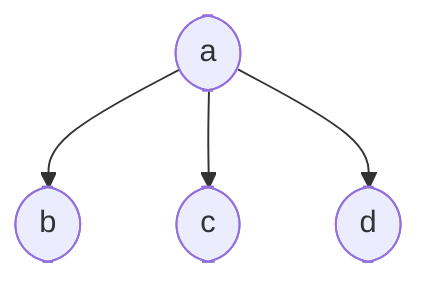
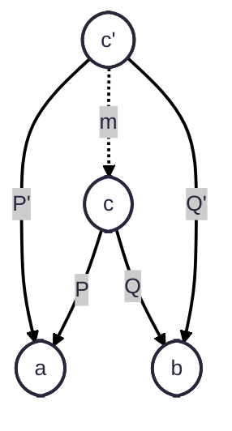
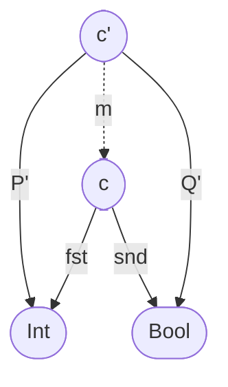
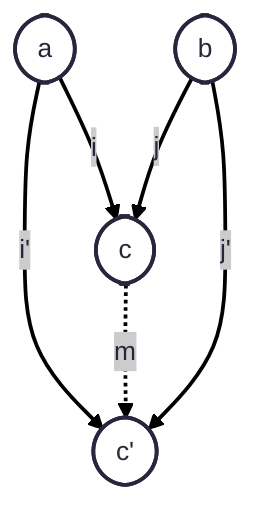

# category-theory
## Category

A category has Objects and arrows that go from one object to another.

### Properties of a category

- Abstraction: Forget the implementation details and threat them as equal.

- Composition: `(h o g) o f = h o (g o f)`

a ------> b -----> c -----> d        a ------------------------> d
    f         g        h                       h o g o f

- Identity: An object has a morphism that maps to itself

Arrows(Morphism): is a path from an object `a` to another `b`. Where objects are names for end of arrows.

a ------> b
    f

## Functions

Mathematical function that for an element of the domain only corresponds a single element of the codomain, but for a codomain element there are multiple correponding elements in the domain.

Domain ------ Codomain

### Isomorphism

A morphism that can be inverted, eg:

a ------> b ------> a   `f :: a -> b`    `g :: b -> a`    `f o g = `<code>id<sub>a</sub></code> `g o f = `<code>id<sub>b</sub></code>
    f          g

Injective (Monomorphism): The elements from Codomain has at max a single image (`f`) element from the Domain. No shrinking colapsing.


Surjective (Epimorphism): Every element from the Codomain has at least one image from the Domain.


Bijective (Isomorphism): Injective and Surjective at the same time, it means 1:1 relationship.


## Void

Unit type `() :: ()`

`unit :: a -> ()`

## Categories

Number of elements (nodes):

- 0 -> empty Category
- 1 -> Single Element with id function

### Pre-Orders

Arrows are not "functions"

Composition

```Haskell
>= :: a >= b
a >= b >= c -> a >= c
```

Identity

```Haskell
a >= a
a <= a
```

### Hom-set

Is a set of arrows

C(a, b), C(b, c)

### Partial Orders

Similar to orders but no loops, e.g. no (`a -> b , b -> a`)

## Monoid

A monoid should satisfy the two properties:

- Composition
- Identity

## Kleisli category


## Terminal Objects

All categories end in the terminal object `()`

```Haskell
a -> ()
b -> ()
```

```
forall a => f :: a -> () & g :: a -> ()

then >> f = g
```

## Initial Object

Is the initial point to many different ones.



## Universal construction

## Products

Product is similar to vectorial projections:

```haskell
  -- for an object c
  p :: c -> a
  q :: c -> b

  -- and there is a pretender c'
  p' :: c' -> a
  q' :: c' -> b

  -- with a unique morphism m
  m :: c' -> c
  p' :: p o m
  q' :: q o m
```



This implies that:

```javascript
P o m = P'
Q o m = Q'
```

In haskell



```Haskell
  Pair :: (a, b)
  fst (x, _) = x
  snd (_, y) = y
```

Bad problems:

```Haskell
  -- Pojection ==> (Int, Bool)

  -- P' can be anything but should return Int, this is bad becasue we lose information
  P' :: (Int, Int, Bool) -> Int
  P' (x, _, _) = x

  -- Q' also lose information
  Q' :: (Int, Int, Bool) -> Bool
  Q' (_, _, b) = b

  -- m should transform c' to c
  m :: (Int, Int, Bool) -> (Int, Bool)
  m (x, _, b) = (x, b)
```

## Coproducts

Instead of projections we have injections:



Thus:

```Haskell
  i' = m o i
  j' = m o j
```
